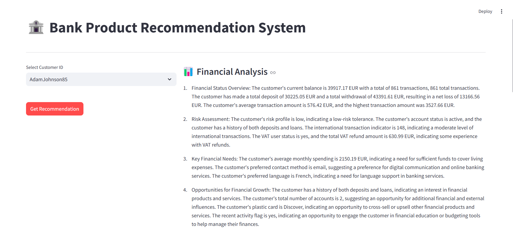
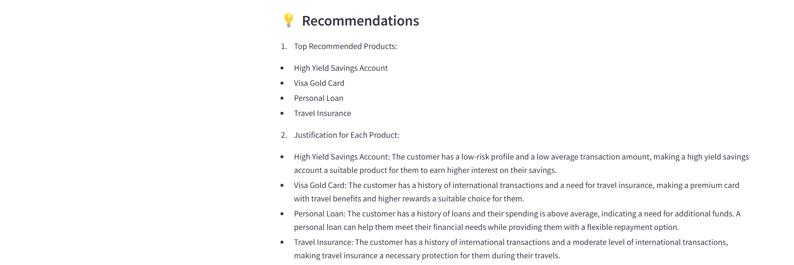
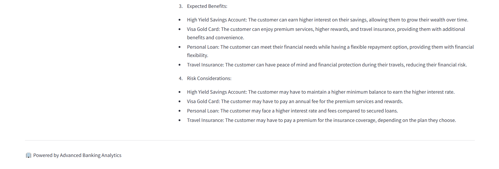
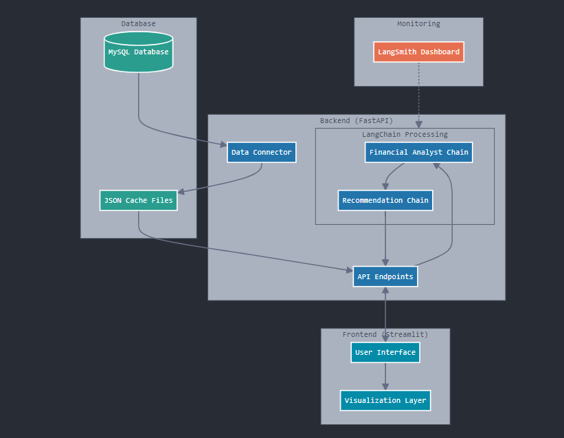
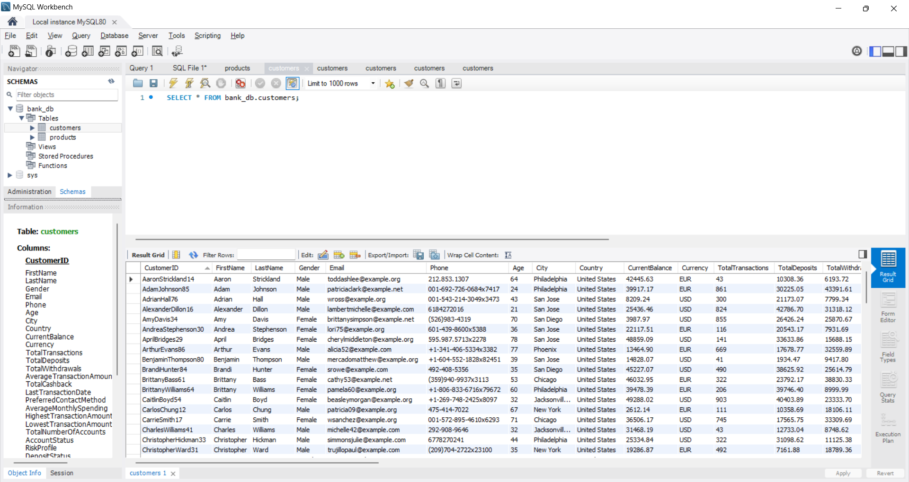
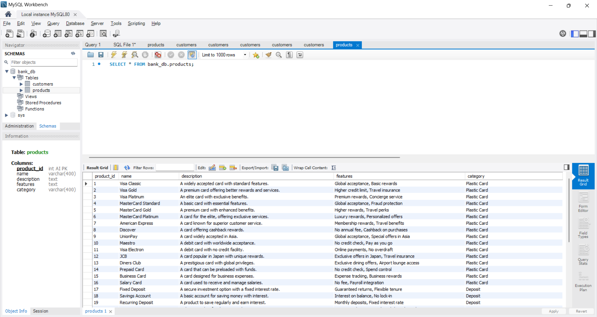
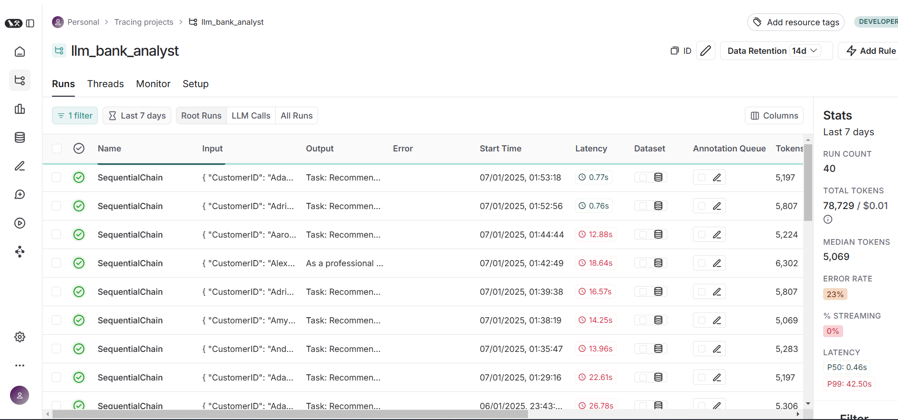
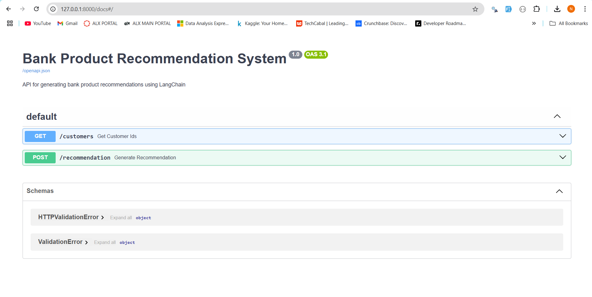

# LLM Bank Analyst

LLM Bank Analyst is an intelligent bank products recommendation engine that leverages Large Language Models (LLMs). The system generates personalized financial product suggestions through analyses of customer data in the Bank's database. The system integrates various modern tools and practices to ensure a robust, scalable, and user-friendly experience, following an LLMOps approach to manage the lifecycle of large language models.




## Table of Contents
- [Project Overview](#project-overview)
- [System Architecture](#system-architecture)
- [Data Schema](#data-schema)
- [LangChain & LangServe Integration](#langchain--langserve-integration)
- [Vector Database Integration](#vector-database-integration)
- [Project Structure](#project-structure)
- [Installation](#installation)
- [Setup](#setup)
- [Usage](#usage)
- [API Documentation](#api-documentation)


## Project Overview

LLM Bank Analyst leverages artificial intelligence to provide personalized banking product recommendations based on both customer financial data and available banking products stored in the Bank's MySQL database. The project uses HuggingFace models through LangChain to create a sophisticated recommendation engine that analyzes customer data and suggests relevant banking products, enhancing the overall customer experience.

The system is built with FastAPI for the backend, Streamlit for the frontend, and integrates monitoring tools like LangSmith to track performance and optimize the recommendation process. This project follows an LLMOps methodology, which focuses on the operationalization and lifecycle management of large language models in production.


## System Architecture

The architecture of LLM Bank Analyst is designed to be modular, scalable, and easy to manage. It consists of the following components:

1. **MySQL Database**:
   - Stores Customer & Product Data.

2. **Data Retrieval**:
   - Customer and product data are automatically fetched from MySQL when the app starts.

3. **Backend API (FastAPI)**:
   - Handles API requests and LangChain processing.

4. **Frontend Interface (Streamlit)**:
   - Provides an interface for customer selection and displaying recommendations.

5. **LangChain Sequential Chain**:
   - Processes the data through two chains: Financial Analyst Chain and Recommendation Specialist Chain.

6. **Monitoring & Analytics (LangSmith)**:
   - Monitors system performance and optimizes the recommendation process.

### Visual Representation of Architecture


## Data Schema

The **LLM Bank Analyst** project uses detailed customer and product data from a mobile banking application to generate recommendations. Below is the schema and description of each key field:

### Customer Data

- **CustomerID**: Unique identifier for each customer.
- **FirstName**: The customer's first name.
- **LastName**: The customer's last name.
- **Gender**: The customer's gender (Male/Female).
- **Email**: The customer's email address.
- **Phone**: The customer's phone number.
- **Age**: The customer's age.
- **City**: The city where the customer resides.
- **Country**: The country where the customer resides.
- **CurrentBalance**: The current balance in the customer's primary account.
- **Currency**: The currency of the account balance (e.g., USD, EUR).
- **TotalTransactions**: Total number of financial transactions performed by the customer.
- **TotalDeposits**: Total amount of money deposited by the customer.
- **TotalWithdrawals**: Total amount of money withdrawn by the customer.
- **AverageTransactionAmount**: Average amount per transaction.
- **TotalCashback**: Total cashback earned by the customer.
- **LastTransactionDate**: Date of the last transaction performed by the customer.
- **PreferredContactMethod**: The customer's preferred method of contact (Email, Phone, SMS).
- **AverageMonthlySpending**: Average monthly spending of the customer.
- **HighestTransactionAmount**: Highest amount spent in a single transaction.
- **LowestTransactionAmount**: Lowest amount spent in a single transaction.
- **TotalNumberOfAccounts**: Total number of financial accounts the customer holds.
- **AccountStatus**: Status of the customer's account (Active, Dormant).
- **RiskProfile**: Financial risk profile of the customer (Low, Medium, High).
- **DepositStatus**: Whether the customer has an active deposit (Yes, No).
- **LoanStatus**: Whether the customer has an active loan (Yes, No).
- **InternationalTransactionIndicator**: Number of international transactions performed by the customer.
- **VATUserStatus**: Indicates whether the customer is a VAT user (Yes, No).
- **TotalVATRefundAmount**: Total amount of VAT refund claimed by the customer.
- **DeviceModel**: Model of the device used for banking transactions.
- **AppVersion**: Version of the banking app used by the customer.
- **RecentActivityFlag**: Indicates if the customer has had recent financial activity (Yes, No).
- **PreferredLanguage**: The customer's preferred language for communication.
- **Delivery**: Total amount spent on delivery services.
- **PlasticCard**: Type of plastic card the customer holds (e.g., Visa Classic, MasterCard Gold).

### Product Data

- **product_id**: Unique identifier for each product.
- **name**: Name of the banking product.
- **description**: A brief description of the product.
- **features**: Key features and benefits of the product.
- **category**: The category of the banking product (e.g., Plastic Card, Deposit, Loan).

### Example MySQL Database Structure
- **Customer Profile Table**:

  

- **Products Table**:

  

## LangChain & LangSmith Integration



**LLM Bank Analyst** utilizes LangChain to power its recommendation engine. The recommendation process is managed through two primary chains:

1. **Financial Analyst Chain**: This chain is responsible for analyzing the customer’s financial data, identifying key metrics, patterns, and potential needs based on the customer’s transaction history and financial profile.

2. **Recommendation Specialist Chain**: Based on the analysis provided by the Financial Analyst Chain, this chain generates specific product recommendations that align with the customer’s financial needs and goals.


### How It Works
1. **Document Storage**: Each customer's data is stored in a MySQL Database.
2. **Query and Retrieval**: When a recommendation is requested, the system does a lookup and retrieves the most relevant customer profile.
3. **SequentialChain Execution**: The retrieved customer data is then processed through the `SequentialChain` for analysis and recommendation generation.

## Project Structure

```bash
llm_bank_analyst/
│
├── src/                    
│   ├── app.py                   # FastAPI application file
│   ├── client.py                # Streamlit client interface
│   ├── config.py                # Configuration file for environment variables
│   ├── db_connect.py            # Script for database connections and data fetching
│   └── requirements.txt         # Python dependencies for the project
│
├── data/                    # Data Generation and SQL Scripts
│   ├── faker_data.py            # Script to generate synthetic customer data
│   ├── inserting_data.py        # Script to generate SQL INSERT statements for customer data
│   ├── customer_profile_insert_statements.sql   # SQL script for creating and inserting customer profile data
│   ├── products_insert.sql      # SQL script for creating and inserting product data
│   ├── customers.json    # JSON file storing fetched customer profile data
│   ├── products.json            # JSON file storing fetched product data
│
├── docs/                    # Project documentation and visual demonstrations
│   ├── mysql_customers.png               # Screenshot of MySQL customer profile table
│   ├── mysql_products.png      # Screenshot of MySQL products table
│   ├── langsmith.png           # Screenshot of LangSmith trace monitoring
│   ├── api.png                 # API Documentation screenshot
│   ├── visual_architecture.png   # API Documentation screenshot
│   ├── streamlit_output_1.png    # Streamlit client recommendation example
│   ├── streamlit_output_2.png    # Streamlit client recommendation example
│   ├── streamlit_output_3.png    # Streamlit client recommendation example
│
├── README.md                # Project README

```


## Installation

1. **Clone the repository**:

```bash
git https://github.com/agyemyaws/llm_bank_analyst.git
cd llm_bank_analyst
```

2. **Create and activate a virtual environment**:

```bash
python -m venv venv
./venv/Scripts/activate
```

3. **Install the required Python dependencies**:

```bash
pip install -r requirements.txt
```

4. **Set up the MySQL database**:

- Use the provided SQL scripts (customer_profile_insert_statements.sql, products_insert.sql) in the data/ directory to populate the customers and products tables in your MySQL database.


## Setup

1. **Create a .env file**:
   - Before running the application, users need to create a `.env` file in the `src/` directory to store their API keys and configuration details. This file should include the necessary environment variables such as API keys, database credentials, and any other configurations required for the project. Use `.env.example` as a reference

2. **LangSmith Account**:
   - Users should have a LangSmith account to enable monitoring and analytics features. The LangSmith API key should be added to the `.env` file along with other environment variables.


## Usage

1. **Start the FastAPI server**:

```bash
uvicorn src.app:app --reload
```

2. **Run the Streamlit client application**:

```bash
streamlit run src/client.py
```

3. **Access the application in your web browser at `http://localhost:8501`**


##  API Documentation



**You can access the API documentation at**:

```bash
http://127.0.0.1:8000/docs
```

**This includes the following endpoints**:

- `GET /customers` - Retrieves a list of all customer IDs. This endpoint is typically used to populate the customer selection dropdown in the Streamlit interface.

- `POST /recommendation` - Generates a bank product recommendation for a specified customer ID. This endpoint triggers the LangChain process, which analyzes customer data and provides tailored product suggestions.